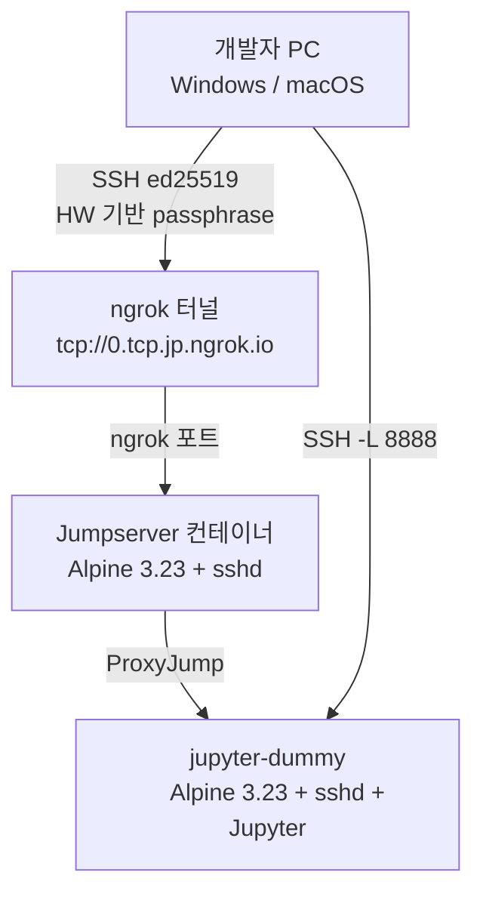

# 02_SSH_Playground

RAG 기반 이력서 피드백 서비스의 **SSH 인프라 검증 프로젝트**입니다.  
Jumpserver 컨테이너를 통한 ProxyJump 방식의 SSH 접근 제어를 로컬에서 검증합니다.

---

## 프로젝트 구조

```
project root/
├── docker-compose.yml
├── README.md
├── ngrok.yml                  ← ngrok 터널 설정
├── auto_connect.ps1           ← 자동 접속 스크립트
├── jumpserver/
│   ├── Dockerfile
│   ├── sshd_config
│   ├── entrypoint.sh
│   ├── authorized_keys        ← 팀원 공개키 등록 파일
│   └── key_generation.ps1     ← Windows 키 발급 스크립트
└── jupyter-dummy/
    ├── Dockerfile
    ├── sshd_config
    ├── entrypoint.sh
    └── authorized_keys        ← jumpserver 공개키 등록 파일 (현재: 개발자 PC 키)
```

---

## 아키텍처 개요



**핵심 원칙:**
- 개발자 PC → jupyter-dummy 직접 접속 **불가** (jumpserver 경유만 허용)
- jumpserver는 ProxyJump 전용 (쉘 접근 차단, PermitTTY no)
- jumpserver에 **private key 저장 금지** (relay 역할만 수행)
- 모든 private key는 클라이언트에만 존재
- 서비스 트래픽(FastAPI → RunPod vLLM)은 SSH 터널과 **완전 분리**, HTTPS API Key 방식 사용

---

## 빠른 시작

### 1. SSH 키 발급 (Windows PowerShell)

```powershell
# 관리자 권한으로 실행
powershell -ExecutionPolicy Bypass -File jumpserver\key_generation.ps1
```

출력된 `Passphrase`와 `authorized_keys 등록용 공개키`를 저장합니다.

### 2. authorized_keys 등록

`jumpserver/authorized_keys` 파일에 공개키 추가 (PR 방식):

```
restrict,port-forwarding,permitopen="jupyter-dummy:2222" ssh-ed25519 AAAA... WIN_PC이름_식별자
```

### 3. 컨테이너 실행

```bash
docker compose up -d --build
docker compose logs jumpserver
docker compose logs jupyter-dummy
```

### 4. ngrok 터널 실행

```powershell
ngrok start jumpserver --config $env:USERPROFILE\AppData\Local\ngrok\ngrok.yml --config .\ngrok.yml
```

### 5. 자동 접속 (권장)

```powershell
# ngrok 자동 감지
powershell -ExecutionPolicy Bypass -File auto_connect.ps1

# 수동 입력
powershell -ExecutionPolicy Bypass -File auto_connect.ps1 -NgrokHost 0.tcp.jp.ngrok.io -NgrokPort 15951

# Jupyter 터널 없이
powershell -ExecutionPolicy Bypass -File auto_connect.ps1 -NoJupyter
```

### 6. 수동 접속

```powershell
# ~/.ssh/config 설정 후
ssh jupyter-dummy

# Jupyter LocalForward
ssh -fN -L 8888:127.0.0.1:8888 jupyter-dummy
# 브라우저: http://localhost:8888
```

---

## SSH 키 관리 정책

| 항목 | 내용 |
|---|---|
| 키 타입 | ED25519 |
| Passphrase | PC 하드웨어(UUID + MAC) 기반 SHA256 자동 생성 |
| 개인키 위치 | `%USERPROFILE%\.ssh\id_ed25519_A` (본인 PC에만 보관) |
| 공개키 등록 | GitHub PR → 팀장 리뷰 → 머지 후 컨테이너 재시작 |
| 키 식별자 형식 | `WIN_PC이름_UUID앞8자리` |

**절대 금지:**
```
❌ 개인키(id_ed25519_A) 공유
❌ passphrase 공유
❌ .ssh 폴더 통째로 압축 전달
❌ jumpserver에 private key 저장
```

---

## ~/.ssh/config 설정

```
Host jump
    HostName <ngrok-host>
    Port <ngrok-port>
    User jump
    IdentityFile ~/.ssh/id_ed25519_A
    IdentitiesOnly yes

Host jupyter-dummy
    HostName jupyter-dummy
    Port 2222
    User user
    ProxyJump jump
    IdentityFile ~/.ssh/id_ed25519_A
    IdentitiesOnly yes
```

---

## jumpserver sshd_config 주요 설정

```
AllowTcpForwarding local         # ProxyJump용 TCP 포워딩만 허용
PermitTTY no                     # 쉘 접근 차단
AllowAgentForwarding no          # Agent 포워딩 차단
permitopen="jupyter-dummy:2222"  # 허용 목적지 제한
```

---

## 팀원 추가 방법

1. 팀원이 `key_generation.ps1` 실행
2. 출력된 공개키로 `jumpserver/authorized_keys`에 추가하는 PR 생성
3. 팀장 리뷰 후 머지
4. 서버에서 `docker compose restart jumpserver`

---

## 검증 완료 항목

- [x] jumpserver 컨테이너 구축 (Alpine + sshd)
- [x] 개발자 PC → jumpserver 인증 (id_ed25519_A)
- [x] ProxyJump 방식 전환 (jumpserver private key 제거)
- [x] ngrok 터널 연결
- [x] jupyter-dummy 컨테이너 구축 (Alpine + sshd + Jupyter)
- [x] SSH LocalForward → 브라우저 Jupyter 접속

## 다음 단계

- [ ] auto_connect.ps1 자동화 스크립트
- [ ] RunPod 실제 연동