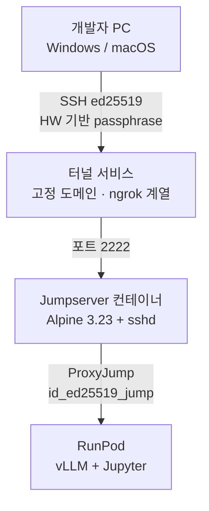

# 02_SSH_Playground

RAG 기반 이력서 피드백 서비스의 **SSH 인프라 검증 프로젝트**입니다.  
Jumpserver 컨테이너를 통한 ProxyJump 방식의 SSH 접근 제어를 로컬에서 검증합니다.

---

## 프로젝트 구조

```
project root/
├── docker-compose.yml
├── README.md
└── jumpserver/
    ├── Dockerfile
    ├── sshd_config
    ├── entrypoint.sh
    ├── authorized_keys        ← 팀원 공개키 등록 파일
    └── key_generation.ps1     ← Windows 키 발급 스크립트
```

---

## 아키텍처 개요



**핵심 원칙:**
- 개발자 PC → RunPod 직접 접속 **불가**
- Jumpserver는 ProxyJump 전용 (쉘 접근 차단)
- 서비스 트래픽(FastAPI → RunPod vLLM)은 SSH 터널과 **완전 분리**, HTTPS API Key 방식 사용

---

## 빠른 시작

### 1. SSH 키 발급 (Windows PowerShell)

```powershell
# 관리자 권한으로 실행
powershell -ExecutionPolicy Bypass -File jumpserver\key_generation.ps1
```

출력된 `Passphrase`와 `authorized_keys 등록용 공개키`를 저장합니다.

### 2. authorized_keys 등록

`jumpserver/authorized_keys` 파일에 공개키 추가:

```
restrict,port-forwarding ssh-ed25519 AAAA... WIN_DESKTOP-이름_식별자
```

### 3. 컨테이너 실행

```bash
docker compose up -d --build
docker compose logs jumpserver
```

### 4. 접속 테스트

```powershell
ssh -p 2222 -i $env:USERPROFILE\.ssh\id_ed25519_A -o IdentitiesOnly=yes jump@localhost
```

**성공 기준:** `PTY allocation request failed` 또는 바로 끊김 → 정상 (쉘 차단 동작)

로그 확인:
```bash
docker compose logs jumpserver
# Accepted publickey for jump from ... → 인증 성공
```

---

## SSH 키 관리 정책

| 항목 | 내용 |
|---|---|
| 키 타입 | ED25519 |
| Passphrase | PC 하드웨어(UUID + MAC) 기반 SHA256 자동 생성 |
| 개인키 위치 | `%USERPROFILE%\.ssh\id_ed25519_A` (본인 PC에만 보관) |
| 공개키 등록 | GitHub PR → 팀장 리뷰 → 머지 후 컨테이너 재시작 |
| 키 식별자 형식 | `WIN_PC이름_UUID앞8자리` |

**절대 금지:**
```
❌ 개인키(id_ed25519_A) 공유
❌ passphrase 공유
❌ .ssh 폴더 통째로 압축 전달
```

---

## 팀원 추가 방법

1. 팀원이 `key_generation.ps1` 실행
2. 출력된 공개키로 `authorized_keys`에 추가하는 PR 생성
3. 팀장 리뷰 후 머지
4. 서버에서 `docker compose restart jumpserver`

---

## 다음 단계
- [ ] 터널 서비스 연결 (ngrok 계열 고정 도메인)
- [ ] Jupyter 더미 컨테이너로 ProxyJump + LocalForward 검증
- [ ] RunPod 실제 연동
- [ ] Docker Compose 전체 구성 (FastAPI, Chainlit, Qdrant, MySQL)